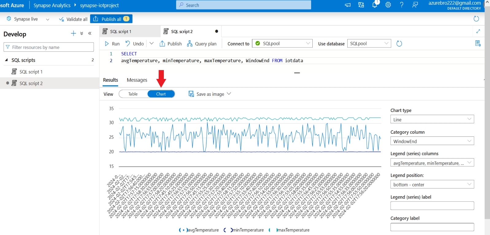

## Real-Time Power BI dashboard

In this project, our focus is on integrating Azure Stream Analytics and Power BI to ingest, process, and visualize real-time telemetry data.

**Azure Stream Analytics** is a serverless, fully managed real-time event-processing service on Azure, that allows users to ingest, process and analyze data streams.

**Synapse Analytics** is a powerful data watehousing solution that offers big data processing ,storage and analytics. 


The data source is [**Raspberry Pi Azure IoT Online Simulator**](https://azure-samples.github.io/raspberry-pi-web-simulator/). This virtual device acts like a sensor that generates real-time temperature and humidity data.It also provides a realistic environment for the project.


We are going to establish connection with the device through **IoT Hub**. 
### 1. Create IoT Hub.
### 2. Add new device.
### 3. In the coding area of the device, replace the placeholder in line 15 with the Azure IoT hub device primary connection string.
 
 
 
 
To ingest and process the data, we are creating and configuring a Stream Analytics job. This job defines the input source and output location, the real-time processing logic with SQL-like queries and transformations, that will be applied to the streaming data.


### 1. Create Stream Analytics job
### 2. Navigate to Inputs ➔ Add input ➔ Select IoT Hub ➔The system will detect the IoT Hub that we created previously.


### 3. Create a Blob storage, to store the data.
### 4. Navigate to Outputs ➔ Add output ➔ Select Blob storage/ADLS Gen2.


### 5. Navigate to Query.

We are now ready to test our pipeline using this simple script. Begin by launching the IoT simulator, then click Refresh to preview the data. Continue by starting the job. Once the job is active, navigate to the Blob storage specified as output, and confirm the successful ingestion and storage of data.


## Configuring Power BI as output
To create the dashboard we are using Power BI Service, the cloud based platform. Currently it is not possible to ingest data directly into Power BI Desktop with Stream Analytics.
### 1. Sign in to your account.
### 2. Create a new workspace.
### 3. Select **Premium per-user** as license mode.


### 4. Navigate to your Stream Analytics job ➔ Outputs ➔ Add output ➔ Select Power BI
### 5. Click Authorize and sign in.
### 6. Give your workspace ID. You can find the ID in the workspace URL. 


To update the query, first we must stop the job. The query below returns aggregated (average, minimum, maximum) data for temperature and humidity.

```sql
SELECT *
INTO 
    ADLSoutput
FROM
    iotinput
     
-- Calculate 5-second average of temperature and humidity
WITH AvgData AS (
    SELECT
        AVG(temperature) AS avgTemperature,
        AVG(humidity) AS avgHumidity,
        System.Timestamp AS WindowEnd
    FROM
        iotinput
    GROUP BY
        TumblingWindow(second, 5)
)

-- Calculate 1-minute maximum and minimum of temperature and humidity
, MinMaxData AS (
    SELECT
        MAX(temperature) AS maxTemperature,
        MIN(temperature) AS minTemperature,
        MAX(humidity) AS maxHumidity,
        MIN(humidity) AS minHumidity,
        System.Timestamp AS WindowEnd
    FROM
        iotinput
    GROUP BY
        TumblingWindow(minute, 1)
)

-- Combine the results with a time-bound JOIN
SELECT
    AvgData.avgTemperature,
    AvgData.avgHumidity,
    MinMaxData.maxTemperature,
    MinMaxData.minTemperature,
    MinMaxData.maxHumidity,
    MinMaxData.minHumidity,
    COALESCE(AvgData.WindowEnd, MinMaxData.WindowEnd) AS WindowEnd
INTO
    powerbioutput
FROM
    AvgData
FULL OUTER JOIN
    MinMaxData
ON
    DATEDIFF(MINUTE, AvgData, MinMaxData) BETWEEN 0 AND 10
``` 
For aggregation we are using tumbling windows which group data into fixed size, non overlapping intervals. Calculations are performed separately for each interval.


We can test the output of the query by clicking on **Test query**.


## Visualizations 
- ### Go to your workspace
- ### Create new dashboard
- ### Edit ➔ Add a tile 
- ### Select Custom Streaming Data
- ### Select your Streaming Dataset


### Create a gauge and line chart with temperature data


### Repeat the process, this time with humidity data


<br>

## Synapse Analytics
Data warehousing stands as a cornerstone in modern data management, offering organizations a powerful solution to consolidate, manage, and analyze large volumes of data. It offers benefits such as:
- **Centralized storage**: Data is stored in one place for easy access.
- **Optimized Performance**: Supports complex queries with fast performance and scalability.
- **Data Integrity**: Ensures consistent and reliable data through governance and standards.
- **Historical Analysis**: Enables tracking trends and forecasting.

## Configuration
- ### Create a Synapse Analytics workspace.
- ### Create a dedicated SQL pool that allocates compute and storage resources to run queries and also serves as our database.
- ### Reset the SQL admin password and create a new password. Synapse as a Stream Analytics job output requires authentication.


### Navigate to your workspace and create a new table.


### To avoid any errors in the dataflow, the column names and their order in the SQL table definition must correspond to the output of the Stream Analytics job query. 

 

### Navigate to the Stream Analytics job and configure Synapse as output.


- ### Modify the Stream Analytics job query to add the new output.
- ### To send data to multiple outputs, you have to create separate copies of the respective part of the query for each output.

```sql
SELECT
    AvgData.avgTemperature,
    AvgData.avgHumidity,
    MinMaxData.maxTemperature,
    MinMaxData.minTemperature,
    MinMaxData.maxHumidity,
    MinMaxData.minHumidity,
    COALESCE(AvgData.WindowEnd, MinMaxData.WindowEnd) AS WindowEnd
INTO
    powerbioutput --FIRST OUTPUT
FROM
    AvgData
FULL OUTER JOIN
    MinMaxData
ON
    DATEDIFF(MINUTE, AvgData, MinMaxData) BETWEEN 0 AND 10

SELECT
    AvgData.avgTemperature,
    AvgData.avgHumidity,
    MinMaxData.maxTemperature,
    MinMaxData.minTemperature,
    MinMaxData.maxHumidity,
    MinMaxData.minHumidity,
    COALESCE(AvgData.WindowEnd, MinMaxData.WindowEnd) AS WindowEnd
INTO
    synapse --SECOND OUTPUT
FROM
    AvgData
FULL OUTER JOIN
    MinMaxData
ON
    DATEDIFF(MINUTE, AvgData, MinMaxData) BETWEEN 0 AND 10
```
### Start the job and navigate to Synapse to retrieve the data.


### Select Chart to create code-free visualizations.

### Optionally we can export and manage the job with VS Code on your local computer using the **Azure Stream Analytics Tools** extension.


## Thank you for watching! :rocket: 